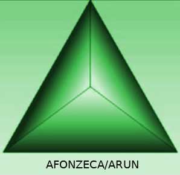
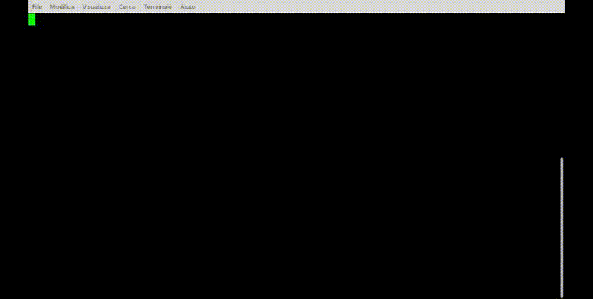

## "Arun" (CLI Microframework) for PHP7.2+ - Version 0.44.2-alpha - (C) 2018 by Angelo Fonzeca

<p align="center">

</p>

### Summary ###


* [What is Arun?](#what-is-arun)
* [It is magic!](#it-is-magic)
* [Why Arun was born?](#why-arun-was-born)
* [Create an Arun project](#create-an-arun-project)
* [Coding Tutorials](#coding-tutorials)
* [Code Auto Generation](#code-auto-generation)
* [Configuration File Support](#configuration-file-support)
* [Phar self-contained executable generation](#phar-self-contained-executable-generation)
* [What about the internal Arun Engine?](#what-about-the-internal-arun-engine)
* [What's next?](#whats-next)
* [License Info](#license-info)
* [Thanks to...](#thanks-to)
* [About releases](#about-releases)
* [Contacts](#contacts)

### What is Arun?

Arun is a microframework for easily developing "console applications" written in PHP OOP. It is quite different from other similar
frameworks/libraries (Like Symfony Console component, Silly, etc.) because Arun uses "Convention Over Configuration" and Annotations for
managing commands and associated code (your console application).

The Arun Microframework has an "out-of-the-box" native support for Dependency Injection by using _Containers_ and _Autowire_
(thanks to PHP-DI) and an organized tree for easily writing your code in a simple way.

Starting from the 0.44.2-alpha version, Arun can auto-generate code for fast and easy development (See Chapter 'Code Auto-Generation' for further information).

_DISCLAIMER: This product is a prototype at an early stage of development and could have security issues... DO NOT USE IT IN PRODUCTION ENVIRONMENTS_

### It is magic!

You create a class in a specific directory (e.g. "app/Console/Domains/CommandNameDomain.php") which extends a specific
"DomainCommand" class, then you define your methods with your code inside, type hinting every parameter (recommended),
set a default value for optional parameters... and you have a new command that you can call from CLI as follow:

```bash
./arun YOURCLASSNAME:YOURMETHOD param1 param2 [param3] [param4=withdefaultvalue]
```

(see the Examples paragraph for better understanding how it works...)

You can also use options (-i --u=username --password=something --check ).

_NOTE: YOURCLASSNAME is called "DOMAIN" and YOURMETHOD is called "ACTION" in the Arun universe..._

Arun will do all the job for you... When invoked, it instantiate an object which corresponds to "DOMAIN", and calls
the Method of the class that corresponds to "ACTION".

Every parameter from CLI is directly mapped to each parameter of the DOMAIN/ACTION method itself thanks to the PHP reflection.
The parameters are also "casted" according to the specified type during the method declaration.

Another "magic" inside Arun is that you have a Dependency Container support (Php-Di) so you can easily inject Services inside your classes.

The last but not the least, Arun can generate an help file "Automatically" for each DOMAIN and its ACTIONS. You can also add additional information (help text)
thanks to "annotations" (special comments inside classes).

By using annotations it is also possible to define options and their help description.

Arun also supports "out-of-the-box" the phar generation, so your package will be "self-contained" and can be installed as exacutable in your /bin, /opt, etc. thanks to Box2 support (See https://github.com/humbug/box)  

<p align="center">

</p>

### Why Arun was born?

Arun was born as a tool for creating a full working framework called "Sensuikan" on which I'm working on. Anyway during the development I realized
that Arun could be used as a stand-alone component. So I made the "Arun Microframework Package".

It can be useful when:

1) You want to write command line code with minimal dependencies in pure PHP OOP style (but you want autoloading composer support, dependency injection,
well organized project... Out of the box!)

2) You need to re-organize/aggregate your cli legacy code inside a more robust project without spending your time for managing command line,
parameters, value mapping, etc.

3) As a base for writing your own framework... Arun can be a good candidate for realizing tools like "Composer", "Laravel Artisan", etc.

4) You want to write workers or services in PHP that can be called from your cron, command line scripts, etc.

Anyway... Too much words... Now Let's making some code... ;-)

### Create an Arun project

You need php 7.2 and Composer installed (https://getcomposer.org) on your machine (tested only on Linux/Ubuntu/Mint).

```bash
composer create-project afonzeca/arun:0.44.2-alpha myprojectname
```

NOTE:

* Due to project "alpha" stage, you MUST specify the version of the framework, as showed above.

* The ArunCore has been separated from Arun starting from the 0.41 - alpha version. The "core" will be installed by composer automatically (You'll find it under vendor/afonzeca/arun-core). Please check [Arun-Core on Github](https://github.com/afonzeca/arun-core) for further details and API library documentation.


_DISCLAIMER: This product is at an early stage of development and could have stability and security issues... DO NOT USE IT IN PRODUCTION ENVIRONMENTS_

### Coding Tutorials

Arun can auto-generate code itself, but in the next few examples I prefer to have a "craftmanship" approach so I will describe step-by-step how to manually develop using the platform.

If you want skip examples and read about auto-generation code directly (not recommended), please refer to chapter ['Code Auto-Generation'](#code-auto-generation) for further information.

Before starting let's create the first project with:

```bash
composer create-project afonzeca/arun:0.44.2-alpha MyFirstArunApplication
cd MyFirstArunApplication
```

**Tutorial 1 - How to write basic command line application**

You want to implement the following domain and action (for our purposes it will be a fake function that will write only messages on screen...):

```bash
./arun table:create users
```

Note: If you like, you can rename "arun" executable to a different name... but if you like Arun Project, I'll be pleased you left the name unchanged ;-)

Anyway, for starting the development you need to do the following actions:

_Step 1_

Inside the folder app/Console/Domains you need to add a class called "TableDomain.php", with its namespace "App\Console\Domains".

The class will extends the "DomainCommand base class" like this:

```php
<?php

namespace App\Console\Domains;

use ArunCore\Annotations as SET;

/**
 * Class TableDomain
 *
 * @SET\DomainEnabled(true)
 * @SET\DomainSyn("This Domain allows to interact with tables")
 *
 * @package App\Console\Domains
*/
class TableDomain extends DomainCommand
{
    /**
     *
     * @SET\ActionEnabled(true)
     * @SET\ActionSyn("This action allows to create a table with a specified name")
     * @SET\ActionOption("--set-key=<name>:Set the primary key name")
     * @SET\ActionOption("--use-camelCaseForNaming:Use camelCase for defining table name")
     *
     * @param string $tableName
     *
     * @throws \Exception
    */
    public function create(string $tableName)
    {
       $this->cOut->writeln(sprintf("Creating table %s", $tableName));
    }
}
```

In other words...

* You need to create a class called "DOMAINNAME"Domain as convention and you must extend DomainCommand (abstract class)
* You need to create methods corresponding to every ACTION for a specific DOMAIN(Classname + Domain suffix).
* The action parameters from CLI will be injected in the same order inside the method parameters.

The parameters values from CLI will be also "casted" according to the type hinting of the method parameters you define
(please use only int, string, float... Array and Objects are not tested! I don't know what happens!)

Note: it is not mandatory to type hint every parameter... but suggested to reduce security problems.   

Now you can call your new domain and obtain help as follow:

```bash
./arun table:create users
```

Arun will do the job for you...

```bash
./arun table

Arun Microframework 0.44.2-alpha - (C) 2018 by Angelo Fonzeca (Apache License 2.0)

Table: This Domain allows to interact with tables

Usage:

  table:ACTION [options] [arguments]

Where ACTIONs are:

create
  Description: This action allows to create a table with a specified name
  Parameters : <tableName> [primaryKey=id] [defaultDb=mydb]
```


**Tutorial 2 - Before continuing... How annotations work?**

As you can see in the example above, there are @SET\SomeThing inside the comments... they are called "annotations")
(they are also used in PhpDoc... if you are familiar with it).

They are directives, that allows Arun to get more information about the class and methods that will be used to define
some behaviors at run-time.  

When you use Arun some annotations are MANDATORY (Just 2):

```
@SET\DomainEnabled(param)
```

where param is "true" or "false"

This allows to enable the class to be called as a "DOMAIN" from command line with Arun if set to true. It also enable
the framework to show the command during help.

NOTE: this annotation/directive is valid only on the top of a class otherwise you'll receive an exception!

```
@SET\ActionEnabled(param)
```

where param is "true" or "false"

This allows to enable the method to be called from command line whith Arun as "ACTION". The behavior is similar to the previous
annotation.

NOTE: this annotation/directive is valid only on the top of a method otherwise you'll receive an exception!

There will be only one DomainEnabled for the Class, and multiple ActionEnabled for each method that must be considered an "Action" (callable from CLI)


Other annotations are not mandatory:

```
@SET\DomainSyn("some spaced text...")
```

```
@SET\ActionSyn("some spaced text...")
```

define the description when help is required for a Domain or Action.

The last annotation is

```
@SET\ActionOption("--optionName=<something>:description")
```

it allows you to define the options for every Action (NOTE: the Options at the moment are visible to all Actions of a Domain),
this directive is used only for the help messages at the moment.
An ActionOption directive can be present multiple time for an Action (Method) so you can define multiple Options.


**Tutorial 3 - Optional Parameters**

It is easy to set optional parameters... Type hint your method parameter and set a default value... for example:


```php
   public function create(string $tableName, string $primaryKey="id", string $defaultDb="mydb")
   {
     // It will print "users" because it is the parameter passed from CLI
     printf("Default Db %s\n",$defaultDb);
     // your code here
     printf("Primary key %s\n",$primaryKey);
     // your code here
     printf("Creating table...%s\n",$tableName);
     // your code here
     //....
     //other code...
     //....
   }
}
```

Now you can call Arun with one, two, or three parameters...

If you type ./arun table:create without parameters you will receive an automatic help... like this:

```
Arun Microframework 0.44.2-alpha - (C) 2018 by Angelo Fonzeca (Apache License 2.0)

Table: Table creation

Usage:

  table:ACTION [options] [arguments]

Where ACTIONs are:

create
  Description: This action allows to create a table with a specified name
  Parameters : <tableName> [primaryKey=id] [defaultDb=mydb]
  Option     : --set-key=<name> ( Set the primary key )
  Option     : --use-camelCaseForNaming ( Use camelCase for defining table name )
```

if you type ./arun without commands, actions, etc. you will receive a "global help" like this:

```
Arun Microframework 0.44.2-alpha - (C) 2018 by Angelo Fonzeca (Apache License 2.0)

Default: A Convention Over Configuration CLI Micro-Framework

Usage:

  DOMAIN:ACTION [options] [arguments]

Available DOMAINS (set of aggregate commands) are:

  default: A Convention Over Configuration CLI Micro-Framework

  producer: Generate Producer Classes!

  table: Table creation

Please write ./arun DOMAIN:help to list the ACTIONS available for a DOMAIN

```


**Tutorial 4 - Let's use Options (like --i --value="xyz" --check-db -u="root")**

arun supports options (short and long) but only in the format -i=something and --optionIlike=something, the format
without "=" is not supported (e.g. '-i something').

You can use your options whenever you want (behind, in the middle or at the end of DOMAIN:ACTION).

Commands like these are all valid:

```
.\arun table:create bills id1 db2 -i --pk="id" --create-fks -u="root"

.\arun -i --pk="id" --create-fks table:create -i bills id1 db2 -u="root"

```

The options are global for a specific DOMAIN(class) and will be accessible from every ACTION(method) inside it.
It's up to you checking if an option is mandatory or pertinent for your methods/actions.

The good news is that you don't need to setup anything! It works itself.


For accessing the options you can use the following methods from your domain class:

1) hasOption for checking the existence of an Option

2) getOptionValue for getting the Option value (for void option like "-i" you will receive a void string... if the
option doesn't exist you will receive "false" bool type - so call hasOption or check for !==false - ).

In our previous example add the following code to the "create" method above

```php

  if($this->hasOption("u")){
             printf("The value of -u is %s\n",$this->getOptionValue("u"));
         }

```

The output will be:

```
./arun -i --pk="id" --create-fks -u bills x abc -u="root"

Default Db abc
Primary key x
Creating table...bills
The value of -u is root

```

**Tutorial 5 - How to inject something**

Arun also supports dependency injection from container.

Inside the folder "containers" you will find:

1) core.php which contains internal reference to internal services that helps Arun working
2) app.php which allows you to define and use your services (and inject them via di container and php-di)

So, edit the file container/app.php... It contains an empty array... now I explain how to fill it!

For example... We want a logger inside our application... the best way is to configure it into the container and than inject it
in our constructor (constructor injection).

Difficult? No, it isn't! Let's start!

_Step 1_

Install monlog with Composer

composer require monolog/monolog

_Step 2_

Edit your containers/app.php... and replace the content with the following:

```php
<?php

use Monolog\Logger;
use Monolog\Handler\StreamHandler;
use Monolog\Formatter\LineFormatter;

return [
    Psr\Log\LoggerInterface::class => DI\factory(function () {
        $logger = new Logger('mylog');

        $fileHandler = new StreamHandler('app/var/mylog.log', Logger::DEBUG);
        $fileHandler->setFormatter(new LineFormatter());
        $logger->pushHandler($fileHandler);

        return $logger;
    }),
];
```

_Step 3_

Now replace in your TableDomain.php the content with the following code:

```php
<?php

namespace App\Console\Domains;

use ArunCore\Annotations as SET;

/**
 * Class TableDomain
 *
 * @SET\DomainEnabled(true)
 * @SET\DomainSyn("This Domain allows to interact with tables")
 *
 * @package App\Console\Domains
*/
class TableDomain extends DomainCommand
{

    /**
     * TableDomain constructor.
     * @param \Psr\Log\LoggerInterface $logger
     */
    protected $logger;

    public function __construct(\Psr\Log\LoggerInterface $logger)
    {
        $this->logger = $logger;
    }

    /**
     *
     * @SET\ActionEnabled(true)
     * @SET\ActionSyn("This method says hello to a specified name")
     * @SET\ActionOption("--set-key=<name>:Set the primary key name")
     * @SET\ActionOption("--use-camelCaseForNaming:Use camelCase for defining table name")
     * @SET\ActionOption("--u=<value>:Set username to be used for the RDBMS")
     * @SET\ActionOption("--l=<value>:Logs something")
     *
     * @param string $tableName
     *
     * @throws \Exception
    */
    public function create(string $tableName, string $primaryKey = "id", string $defaultDb = "mydb")
    {

        // It will print "users" because it is the parameter passed from CLI
        printf("Default Db %s\n", $defaultDb);
        // your code here
        printf("Primary key %s\n", $primaryKey);
        // your code here
        printf("Creating table...%s\n", $tableName);
        // your code here
        //....
        //other code...
        //....

        if ($this->hasOption("u")) {
            printf("The value of -u is %s\n", $this->getOptionValue("u"));
        }

        if ($this->hasOption("l")) {
            $this->logger->error($this->getOptionValue("l"));
        }
    }
}
```

In other word, the LoggerInterface (the right way!) is required inside the constructor and it will injected by Arun via
 di-container when the application starts!

Thanks to the constructor, the logger object is stored inside the $logger propertie so it is accessible from other methods.

```php
protected $logger;

    public function __construct(\Psr\Log\LoggerInterface $logger)
    {
        $this->logger = $logger;
    }
```

Thanks to the following code inside the "create" method, every time the Arun is called with "-l", a line into the log
is written with its parameters:

```php
   if ($this->hasOption("l")) {
            $this->logger->error($this->getOptionValue("l"));
        }
```

if you run Arun the result will be:

```
./arun -i --pk="id" --create-fks -u="root" table:create -p bills x abc -u="root" -l="Test1"

Default Db abc
Primary key x
Creating table...bills
The value of -u is root

```

If you check for your app/var/mylog.log, you will find the value of the "-l" option (Test1).

For further information regarding the use of Dependency Injection inside Arun please refer to https://PHP-DI.org/
by Matthieu Napoli and contributors.


**Tutorial 6 - ExampleDomain**

Inside the Arun package there is a file called "ExampleDomain.php" (under app/Console/Domains) that can be used as base for
your Domain development. It also shows undocumented features.

Feel free to delete it!

### Code Auto Generation ###

ARUN can autogenerate code for class DOMAINs and method ACTIONs. Annotations and PHPDOC compatible comments are also generated.

ARUN has a built-in domain called "gen" dedicated to code-generation. Let's see the help guide:

```

./arun gen

Arun Microframework 0.44.2-alpha - (C) 2018 by Angelo Fonzeca (Apache License 2.0)

Gen: Generates code for Arun Development Speed-up

Usage:

  gen:ACTION [options] [arguments]

Where ACTIONs are:

domain
  Description: This action generates a Domain class for Arun automatically
  Parameters : <domainName>
  Option     : --synopsis='your domain description' ( Set the description of the domain )
  Option     : --disabled ( Generate the Domain class file but with DomainEnabled set to FALSE )
  Option     : -f|--force ( Force domain code overwriting - NOTE! It will destroy your hand-made code! - )

action
  Description: This action generates ARUN CODE for an Action linked to a Domain class
  Parameters : <domainName> <actionName>
  Option     : --synopsis='your action description' ( Set the description of the action )
  Option     : --disabled ( Generate the Action method but disabled )

parameter
  Description: This action adds a parameter to a specified action(method) linked to a domain(class)
  Parameters : <domainName> <actionName> <paramName>
  Option     : --type='int|string' ( Set the 'type'. Otherwise the type will be 'string' )
  Option     : --default='your default value' ( Otherwise the value will be not set. )

```

As you can see, at the moment, it can generate parametrized domains and actions for you (options will be included in the next releases).

In the next paragraph you will find some examples.

Note: the domain "gen" can be disabled for security purposes. Go to "app/Console/Domains/GenDomain.php" inside your application
 and de-activate the Domain by modifying the annotation @SET\DomainEnabled(true) to @SET\DomainEnabled(flase)

**Generating Domain**

According to the code inside the tutorials of the previous chapter, let's generate the "TableDomain" set of commands and the "create" action by using the auto-generation "gen" domain which is present, as told previously, "out-of-the-box" when Arun framework is installed. Please refer to Tutorial 1 for code details in the previous Chapter.

```bash

./arun gen:domain Table --synopsis="This Domain allows to interact with tables"

Generating Table for you.

* Synopsis set to "This Domain allows to interact with tables"

Done! Please check app/Console/Domains/TableDomain.php

```

The following code will be generated inside app/Console/Domains/TestDomain.php

```php

<?php
/**
 * This file TableDomain.php has been generated by "Arun - CLI Microframework for Php7.2+" released under the following terms
 *
 * Copyright 2018 Angelo FONZECA ( https://www.linkedin.com/in/angelo-f-1806868/ )
 *
 * Licensed under the Apache License, Version 2.0 (the "License");
 * you may not use this file except in compliance with the License.
 * You may obtain a copy of the License at
 *
 * http://www.apache.org/licenses/LICENSE-2.0
 *
 * Unless required by applicable law or agreed to in writing, software
 * distributed under the License is distributed on an "AS IS" BASIS,
 * WITHOUT WARRANTIES OR CONDITIONS OF ANY KIND, either express or implied.
 * See the License for the specific language governing permissions and
 * limitations under the License.
 *
 * Linkedin contact ( https://www.linkedin.com/in/angelo-f-1806868/ ) - Project @ https://github.com/afonzeca/arun
 *
 * Code Example made using the Arun CLI Micro-framework for PHP7.2+
 *
 */

namespace App\Console\Domains;

use ArunCore\Annotations as SET;

/**
 * Class TableDomain - This Domain allows to interact with tables
 *
 * @SET\DomainSyn("This Domain allows to interact with tables")
 * @SET\DomainEnabled(true)
 *
 * @SET\DomainEOA("TableDomain")
 */
class TableDomain extends DomainCommand
{
}

```

As you can see, your new Domain is ready!

Important Notes:

* If you need to "re-generate" the class, use the -f or --force option (NOTE! It will destroy your hand-made code!)
* NEVER remove the @SET\DomainEOA or @SET\ActionEOA inside code, they are place-holders for the "gen" domain! Otherwise it will not work.
* If case you want to make by hand your Arun code and in the future you would like using "gen" domain actions, please remember to add the annotations above

**Generating Action**

Let's generate the "create" action, according to the previous chapter!

```bash
./arun gen:action Table create --synopsis="This action allows to create a table with a specified name"

Generating action Create for you.

* Synopsis set to "This action allows to create a table with a specified name"

Action created! Please check app\Console\Domains\TableDomain.php for adding your code
```

Note: the commands and parameters are CaSe SeNsItIvE

Let's see the generated code:

```php
<?php

...
...
...

namespace App\Console\Domains;

use ArunCore\Annotations as SET;

/**
 * Class TableDomain - This Domain allows to interact with tables
 *
 * @SET\DomainSyn("This Domain allows to interact with tables")
 * @SET\DomainEnabled(true)
 *
 * @SET\DomainEOA("TableDomain")
 */
class TableDomain extends DomainCommand
{

    /**
     *
     * create - This action allows to create a table with a specified name
     *
     * @SET\ActionEnabled(true)
     * @SET\ActionSyn("This action allows to create a table with a specified name")
     *
     * @SET\ActionEOA("create")
     */
    public function create()
    {
        $this->cOut->writeln("This action must be defined.");
    }
}

```

Let's replace the code inside create() with the following:

```php
   $this->cOut->writeln(sprintf("Creating table %s", $tableName));
```

NOTE: When an action is created, it will not replaced if you run _Arun_ again with the same action name. If you need to replace it, you must delete the action inside the domain code manually first. Otherwise you will get an error like this:

```bash
./arun gen:action Table create --synopsis="This action allows to create a table with a specified name"

Action create is already present!

Please remove it manually from the code and start the process again.
```

**Adding Parameters**

```bash
./arun gen:parameter Table create tableName --type="string"

Adding parameter tableName to action Table@create for you.

Parameter created! Please check app\Console\Domains\TableDomain.php for adding your code
```

Let's see code...

```php
use ArunCore\Annotations as SET;

/**
 * Class TableDomain - This Domain allows to interact with tables
 *
 * @SET\DomainSyn("This Domain allows to interact with tables")
 * @SET\DomainEnabled(true)
 *
 * @SET\DomainEOA("TableDomain")
 */
class TableDomain extends DomainCommand
{
    /**
     *
     * create - This action allows to create a table with a specified name
     *
     * @SET\ActionEnabled(true)
     * @SET\ActionSyn("This action allows to create a table with a specified name")
     *
     * @var string $tableName
     * @SET\ActionEOA("create")
     */
    public function create(string $tableName)
    {
       $this->cOut->writeln(sprintf("Creating table %s", $tableName));
    }
}
```

NOTE: When a parameter is created for an action, it will not replaced if you run _Arun_ again with the same parameter name on the same action. If you need to replace it, you must delete the parameter inside the action code manually first. Otherwise you will get an error like this:

```bash
/arun gen:parameter Table create defaultDb --type="string" --default="mydb"

Adding parameter defaultDb to action Table@create for you. Default value mydb

Arun EXCEPTION: Parameter already exists!

```

**Adding parameters with values**

According to the Tutorial 3 of the previous chapters, let's add "primarykey" and "defaultDb" parameters with their default value...

```bash
./arun gen:parameter Table create primaryKey --type="string" --default="id"

Adding parameter primaryKey to action Table@create for you. Default value id

Parameter created! Please check app\Console\Domains\TableDomain.php for adding your code
```

```bash
./arun gen:parameter Table create defaultDb --type="string" --default="mydb"

Adding parameter defaultDb to action Table@create for you. Default value mydb

Parameter created! Please check app\Console\Domains\TableDomain.php for adding your code
```

The result will be:

```php
use ArunCore\Annotations as SET;

/**
 * Class TableDomain - This Domain allows to interact with tables
 *
 * @SET\DomainSyn("This Domain allows to interact with tables")
 * @SET\DomainEnabled(true)
 *
 * @SET\DomainEOA("TableDomain")
 */
class TableDomain extends DomainCommand
{

    /**
     *
     * create - This action allows to create a table with a specified name
     *
     * @SET\ActionEnabled(true)
     * @SET\ActionSyn("This action allows to create a table with a specified name")
     *
     * @var string $tableName
     * @var string $primaryKey='id'
     * @var string $defaultDb='mydb'
     * @SET\ActionEOA("create")
     */
    public function create(string $tableName, string $primaryKey='id', string $defaultDb='mydb')
    {
        $this->cOut->writeln(sprintf("Creating table %s", $tableName));
    }
}
```


**Actions not implemented into "gen" yet**

1) If you need to add options like (--i, --value='default', etc.) you need to add them manually... (for now)

So add the following code to the examples above under the other annotations (@SET), according to the examples above

```php
    * @SET\ActionOption("--set-key=<name>:Set the primary key name")
    * @SET\ActionOption("--use-camelCaseForNaming:Use camelCase for defining table name")
```

Please refer to the Tutorial 5 for analyzing "options" managing

2) For adding services inside the "Dipendency Injection Container", please check tutorial configuration showed in the previous chapter.


### Configuration File Support ###

For statical configuration, Arun uses the config/config.php file accessible via the global function "Conf()".

Anyway it supports "out-of-the-box" the ".env" files, thanks to the library from PhpDotEnv by VLucas (https://github.com/vlucas/phpdotenv)

In particular refer to .envcli file for configuring Arun!

If you need to extend the .envcli file with your parameters, use getenv("KEY") inside your code where "KEY" is
the key of your _env_ variable (at the moment Arun doesn't use caching for _.envcli_ files... so you can use it directly)


**Notes**

Arun has many undocumented functions, internals and other useful things... The documentation will be improved ASAP! ;-)

### Phar self-contained executable generation

Arun supports "phar" generation, thanks to Box2 and self-ready configuration "box.json" file.

You need three steps to generate the phar:

* Create a bin directory inside your project and change dir with:

```bash
mkdir bin
cd bin
```

* Download inside bin/ the "box.phar" the executable with wget or other tools ( download from [https://github.com/humbug/box/releases] ). For example [https://github.com/humbug/box/releases/download/3.3.1/box.phar]
* Set execution permissions and go to your project root directory

```bash
chmod 755 box.phar
cd ..
```

* Now you can generate your myApp.phar by running

```bash
./arun gen:phar
```

* In your project under var/boxed, you will find your myApp.phar...

* Rename it according to your needs, with or without .phar extension, and move it in your preferred path

NOTES:

* "gen" and "example" domains are disabled by default in your generated .phar application

* If you need to write/edit/manipulate files with your generated .phar application, remember in your code to specify absolute paths and/or use "getcwd" function. The ``` __DIR__ ``` will refer to path INSIDE the package and your code will not work outside that "box".

### What about the internal Arun Engine? ###

When you call Arun, it performs the following steps (It's not Black Magic :D)

* Configures and gets the DI Container, starts the "ConsoleInput" and processes the parameters
* Injects some dependencies from container
* Makes some security checks on parameters (e.g. strips some characters and other checks) - CODE WRITTEN BUT NOT SUPPORTED YET
* By using reflection analyzes the structure of the ACTION requests (e.g. type hinting of parameters and number of them)
* Checks if the annotations define a Class or Method
* If check passed, the framework gets the class corresponding to DOMAIN (in our case "table"), it uses a factory to instantiate the class
* Inside the method ACTION (e.g. create) Arun injects the parameters passed (and if required also dependencies from container to the constructor)
* The method "ACTION" (e.g. create) is called...
* If something goes wrong a contextual help will be displayed (by using reflection the framework will describe the DOMAIN and ACTIONS according to the
   parameters passed and annotations)

Arun is written respecting S.O.L.I.D. principles (ehm... I try to respect them at my best ;-) ), some 12factors principles and full OOP approach!

Feel free to browse the code, it's full documented!

_Note for developers_

Arun contains a phpunit.xml file so you can use PhpUnit and PhpUnitWatcher from Spatie during development out of the box!

I also made some UT inside the core part (under _vendor/afonzeca/arun-core_), you will find them in the _tests_ directory so you can understand better how Arun works!


### What's next? ###

The next releases will hopefully include:

* Support for full color, tables and fancy things for outputting information
* Security improvements
* Much more complete and full Unit Tests
* Mandatory or "optional" options
* MVC support ( I will explain the idea in the future ;-) )
* Sub-commands
* Many other features not listed here

See the "changelog.txt" file inside the package for checking the changes compared to the previous version.

### License Info ###

This file is part of "Arun - CLI Microframework for Php7.2+" released under the following terms

Copyright 2018 Angelo FONZECA ( https://www.linkedin.com/in/angelo-f-1806868/ )

Licensed under the Apache License, Version 2.0 (the "License");
you may not use this file except in compliance with the License.
You may obtain a copy of the License at

http://www.apache.org/licenses/LICENSE-2.0

Unless required by applicable law or agreed to in writing, software
distributed under the License is distributed on an "AS IS" BASIS,
WITHOUT WARRANTIES OR CONDITIONS OF ANY KIND, either express or implied.
See the License for the specific language governing permissions and
limitations under the License.


### Thanks to... ###

* My lovely wife Carla! ILY

* My friend LucaM. from TGG ;-)

* Heavy Metal

* Sir Clive Sinclair, Tony Tebby, Adriano Olivetti, Brian Kernighan and Dennis Ritchie... they are the real IT heroes!

### About releases ###

Project link: https://github.com/afonzeca/arun ( First project version link: https://github.com/afonzeca/bosun )

Main core library: https://github.com/afonzeca/arun-core

See changelog.txt inside the package for further details about framework improvements.

### Contacts ###

Let's keep in touch! My Linkedin contact https://www.linkedin.com/in/angelo-f-1806868/


Thank you so much for your interest in Arun!
Angelo Fonzeca
